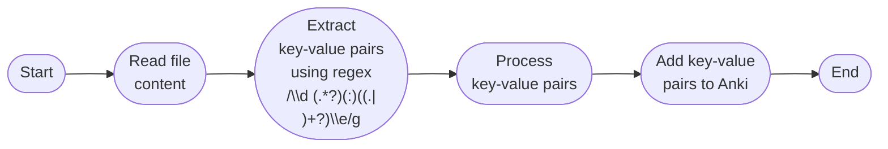

# AnkiAuto


## Description
AnkiAuto is a versatile tool that enhances your study routine by automatically converting key-value pairs in your notes into Anki flashcards. Whether you’re taking notes in text files, markdown, or any other format, AnkiAuto allows you to easily mark terms and definitions using the special `\d` and `\e` markers. Once you place your files in a specified directory, AnkiAuto scans these files and adds or updates the corresponding entries in your Anki decks.

Updating a flashcard is just as simple—if you modify the definition associated with a term, AnkiAuto will automatically update the flashcard the next time it runs. The program needs to be manually executed to process new or updated notes, but it can also be scheduled to run automatically using a cron job for continuous updates.

All the instructions you need to set up and use AnkiAuto are provided below.

## Stack

This project is designed to process a filtered list of files using a TypeScript-based Node.js program. The stack involves TypeScript for development, shell scripting for file filtering, and Node.js (running the compiled TypeScript) for execution. The project workflow includes compiling TypeScript files, filtering files based on a regular expression, and processing those files using the compiled TypeScript code running on Node.js.

### 1. **TypeScript**

- **Role:** Development Language
- **Purpose:** TypeScript is used to write the core logic of the Node.js application, such as file processing, data manipulation, and interaction with the AnkiConnect API.

### 2. **Shell Scripting**

- **Role:** Automation and File Filtering
- **Purpose:** Shell scripts are used to automate the process of filtering files based on a regex pattern.

### 3. **Node.js**

- **Role:** Runtime Environment
- **Purpose:** Node.js is used to execute the compiled TypeScript files, specifically processing the list of filtered files passed from the shell script.

## Project Structure

```plaintext
├── src/
│   ├── *.ts                   # TypeScript source files
├── bin/
│   ├── Entrypoint.js          # Compiled entry point for the Node.js application
├── filter.sh                  # Shell script for filtering files
├── execute.sh                 # Main shell script to compile, filter, and run the Node.js program
├── tsconfig.json              # TypeScript configuration file
├── package.json               # Node.js dependencies and scripts
└── README.md                  # Project documentation (this file)
```

## Shell Script Flow


## Node.js File Processing Flow


## Prerequisites

Ensure that you have the following installed:

- **Node.js** (v20.x or higher)
- **npm** (v9.x or higher)
- **TypeScript** (globally installed via `npm install -g typescript`)
- **AnkiConnect** [(AnkiConnect API installed and running)](https://ankiweb.net/shared/info/2055492159)

## Setup Instructions

1. **Clone the Repository:**

   ```bash
   git clone https://github.com/Yaremadzulynsky/AnkiAuto
   cd AnkiAuto
   ```

2. **Install Dependencies:**

   Navigate to the project directory and install the necessary npm packages:

   ```bash
   npm install
   ```

3. **Configure the Directory:**

   Modify the `DIRECTORY` variable in the `filter.sh` script to point to the directory where you want to search for files.

## Key-Value Pair Structure for Anki Integration

The program identifies key-value pairs in your files using special markers to define the start and end of each entry. These entries are then processed and added to Anki. The markers used are:

- `\d` (definition start): Indicates the beginning of a key-value pair.
- `\e` (definition end): Indicates the end of a key-value pair.

### Simple Key-Value Pairs

To define a simple key-value pair, place the key immediately after `\d`, followed by a colon `:` and then the value. Here’s an example:

```plaintext
\d Organism: A living thing that can grow, reproduce, and respond to stimuli. \e
```

In this example:

- **Key:** `Organism`
- **Value:** `A living thing that can grow, reproduce, and respond to stimuli.`

### Key-Value Pairs with Lists

You can also create a key-value pair where the value is a list. Each item in the list should be prefixed with a hyphen `-`. Here’s how to structure it:

```plaintext
\d Animals:
- Dogs
- Cats
- Birds
- Fish
\e
```

In this example:

- **Key:** `Animals`
- **Value:** A list containing `Dogs`, `Cats`, `Birds`, and `Fish`.

### Summary of Structure

- **Key:** The text between `\d` and `:` is treated as the key.
- **Value:** The text after `:` until `\e` is treated as the value. If the value contains multiple items, prefix each item with `-` to indicate a list.

The program processes these key-value pairs and adds them to Anki, allowing you to easily integrate structured information into your flashcards.

## How to Use

**NOTE: ANKI MUST BE OPEN DURING PROGRAM EXECUTION AND MUST HAVE [ANKI CONNECT](https://ankiweb.net/shared/info/2055492159) INSTALLED**

### Step 1: Add Directory to Search

Update the `DIRECTORY` variable in the `filter.sh` script to point to the directory where you want to search for files.

```bash
DIRECTORY="path/to/directory"
```

### Step 2: Give Execute Permission to the `execute.sh` & `filter.sh` scripts

**Note: This only needs to be done once**

```bash
chmod +x execute.sh
chmod +x filter.sh
```

### Step 3: Run the Main Script

- **Note 1:** Run this script anytime you want to re-scan your folder for new notes. Optionally, set up a cron job for automation.
- **Note 2:** If the definition does not exist, it will be added; otherwise, it will be updated with the new info.

Execute the `execute.sh` script with a regex pattern as an argument to filter files:

```bash
./execute.sh "your-regex-pattern"
```

To search for all files, use the following command:

```bash
./execute.sh ".*"
```

- The `execute.sh` script will:
  - Compile TypeScript files using `tsc`.
  - Use the `filter.sh` script to generate a list of files that match the provided regex pattern.
  - Pass the filtered file list to the Node.js program (`Entrypoint.js`) for processing.

### Example:

```bash
./execute.sh ".*\.txt$"
```

In this example, the script will process all `.txt` files in the specified directory.

## Customization

- **Changing the Directory:**
  - Update the `DIRECTORY` variable in `filter.sh` to point to the desired directory for file filtering.
- **Modifying the Processing Logic:**
  - Edit the `Entrypoint.ts` file in the `src/` directory to customize how the filtered files are processed.

## Troubleshooting

- **Compilation Issues:**
  - Ensure that TypeScript is installed globally and that your `tsconfig.json` is correctly configured.

- **File Not Found Errors:**
  - Verify that the `DIRECTORY` variable in `filter.sh` is set to the correct path.

- **Node.js Execution Errors:**
  - Ensure that the Node.js version is compatible with the compiled JavaScript code.
